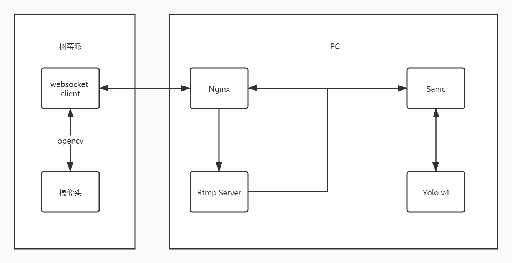
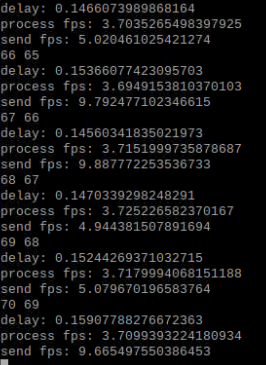
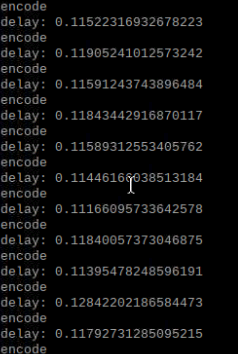

# 端云协同的目标检测系统

## 系统需求

使用树莓派采集图像并传输到PC上，PC进行目标检测后返回检测结果给树莓派

## 系统运行硬件环境

如无特殊说明，系统运行硬件环境如下

Server 系统：Ubuntu 18.04

Server CPU：AMD Ryzen 5 1600

Server GPU：GTX 1070ti

Client：树莓派3b+ （Broadcom BCM2837B0，1GB LPDDR2 SDRAM）

Client 系统：Linux raspberrypi 5.4.51-v7+

Client 摄像头：Pi Camera V2(IMX219)

## 系统整体框架

经过多次迭代，目前系统的整体框架如下



在对实时性要求不高的情况下，可以采用树莓派内部的h264硬件编码器对视频进行编码，推流到由nginx搭建的Rtmp server上，Sanic从Rtmp server上采流，在检测后将结果发回，除去目标检测的时间，此方法大概会有1秒的延迟，由于使用h264视频编码且使用rtmp协议进行传输，该方法所需的传输带宽较低，传输过程也比较稳定

在对实时性要求较高的情况下，会将树莓派采集的图像经过jpg编码压缩后直接发送到后端框架Sanic上，检测后将结果发回。


## 项目中遇到的各种问题及相应的解决过程

### 图片编码方式的选择和对于编码时间过长的处理

主流的编码格式主要有BMP，PNG，JPEG，WebP

BMP没有对图像进行压缩，不考虑

PNG的压缩率不足以满足需求，不考虑

JPEG和WebP的压缩率都可以满足需求，但WebP的编码耗时过高，最终选取JPEG

由于树莓派硬件性能不足，使用JPEG编码大致需要0.03秒的时间，对于这一问题采用了两种优化策略

一是使用libjpeg-turbo而非opencv进行编码（也可以重新编译opencv使其使用libjpeg-turbo），提高编码的效率（实际速度大致提升了30%）

二是将树莓派处的代码改为异步的代码，发送下一帧的图片不需要等待上一帧结果的到达

### 后端框架的限制

一开始使用的后端框架为Flask，由于Flask是同步框架，为了使用可全双工通信的websocket，使用了socketio来搭建相应异步处理过程，性能比起原生支持异步的Tornado，Sanic要慢上很多

后期将框架换为了Sanic

使用Flask+socketio，从获取到一帧画面，到最后返回结果的延迟大约为0.14~0.15秒



使用sanic框架后该时间缩短到0.11~0.12秒



### 对网络状况的自适应

由于时间关系，这个算法并没有进行严格的验证，部分参数也需要手动调节，基本思路是在开始前先发送一定的数据测出平均延迟avg_delay，当检测到延迟超过某一程度时就降低帧率，否则一直提升帧率到上限

```python
delay = time.time()-read_time

MAX_FRAME_RATE = int(1./avg_delay)
if delay > avg_delay + MAX_DELAY_CHANGE:
	if FRAME_RATE != 1:
		FRAME_RATE -= 1
else:
	if FRAME_RATE < MAX_FRAME_RATE:
		FRAME_RATE += 1

avg_delay = 0.95*avg_delay + 0.05*delay
```


## 心得与体会

生产实习的目的是为了让我们接触生产科研，通过实践培养我们综合运用所学知识，去解决实际问题的能力。这次生产实习的课题是端云协同的

这次实习的课题与我们专业的课程有很多的联系，通过本次实习，我加深了对于本专业的了解，，在实习的过程中我也学到了很多知识


## 使用到的开源项目

[Nginx](https://nginx.org/en/)

[NGINX-based Media Streaming Server](https://github.com/arut/nginx-rtmp-module)

[Pytorch-YOLOv4](https://github.com/Tianxiaomo/pytorch-YOLOv4)

[Object-Detection-Metrics](https://github.com/rafaelpadilla/Object-Detection-Metrics)

各类python第三方库